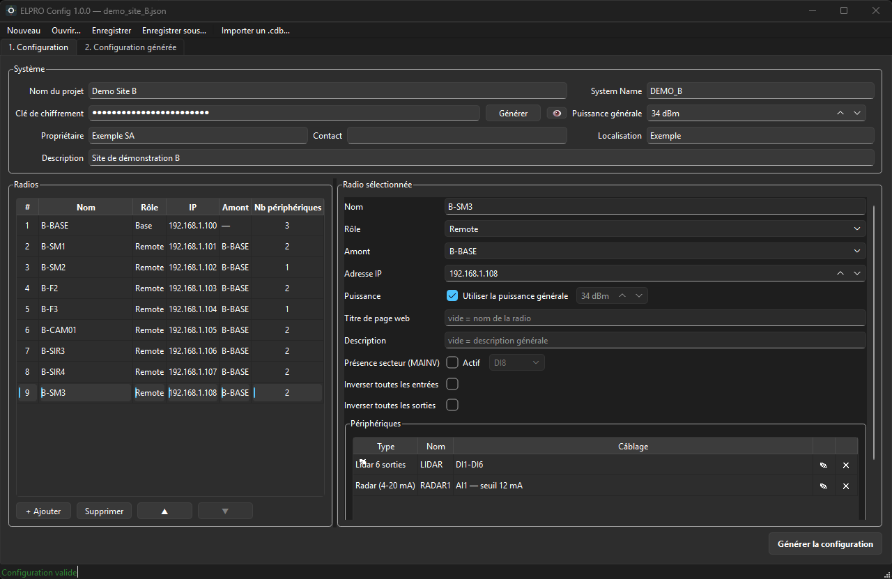
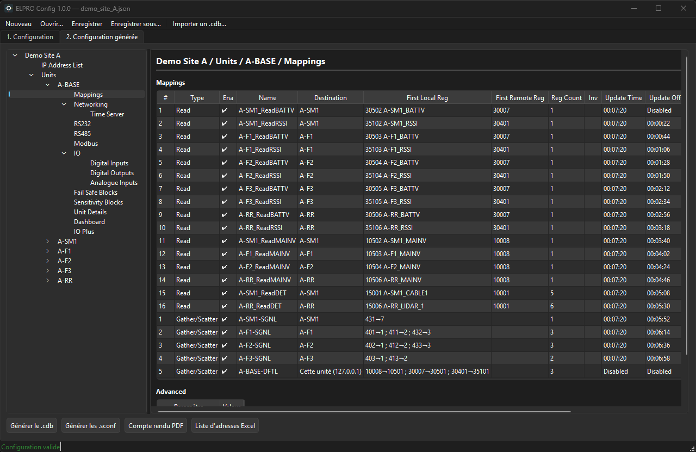

<p align="center">
  
</p>

<h1 align="center">ELPRO Config</h1>

<p align="center">
  Génération automatique de configurations standardisées pour les radios <b>ELPRO 415U-2-C4</b>.
</p>

<p align="center">
  <a href="https://github.com/lucapancottigz/elpro-config/releases/latest/download/ELPRO_Config_Setup.exe">
    
  </a>
</p>

<p align="center">
  <a href="https://github.com/lucapancottigz/elpro-config/releases/latest"></a>
  
  <a href="https://github.com/lucapancottigz/elpro-config/releases"></a>
  <a href="LICENSE"></a>
</p>

---

**ELPRO Config** décrit un réseau radio (radios, rôles, périphériques câblés) et produit en un clic tous les fichiers de mise en service selon le standard de configuration GeoAzimut : plan de registres, polling, fail-safe et logique IO Plus.





## Fonctionnalités

- **Saisie du projet** : système, radios (base, remotes, repeaters), amonts, adresses IP et périphériques câblés (câbles, lidars, feux, sirènes, radars…).
- **Plan de registres standard** calculé automatiquement : détections, comflags, registres de défaut, tensions, RSSI, commandes.
- **Polling et fail-safe** : grille de polling régulière, fail-safe sur tous les registres de défaut.
- **Visualisation** de la configuration générée, présentée comme dans le logiciel CConfig.
- **Exports** :
  - fichier projet `.cdb` à ouvrir dans CConfig ;
  - logiques IO Plus `.sconf` (livrées **désactivées**) ;
  - compte rendu PDF ;
  - liste d'adresses Excel.
- **Import** d'un `.cdb` existant (radios, rôles, IP, amonts, clé).
- **Projets** enregistrés au format `.elpro.json`.

## Installation

1. Cliquer sur le bouton **Télécharger** ci-dessus, ou aller dans [Releases](https://github.com/lucapancottigz/elpro-config/releases/latest).
2. Lancer `ELPRO_Config_Setup.exe`. Des droits administrateur sont demandés, car l'application est installée pour tous les utilisateurs du PC.
3. Choisir les raccourcis (bureau, menu Démarrer), puis installer.

> **Avertissement Windows SmartScreen** — L'installateur n'est pas signé numériquement. Windows peut afficher « Windows a protégé votre ordinateur ». Cliquer sur **Informations complémentaires**, puis sur **Exécuter quand même**. Vous pouvez vérifier le fichier téléchargé avec l'empreinte SHA-256 publiée dans la release.

**Configuration requise :** Windows 10 ou 11, 64 bits. Python n'est pas nécessaire.

**Désinstallation :** Paramètres › Applications › ELPRO Config › Désinstaller. Vos projets dans `Documents\ELPRO Config` sont conservés.

## Démarrage rapide

1. Ouvrir un exemple : **Ouvrir** › `examples\demo_site_A.json`.
2. Onglet 1 : vérifier les radios et leurs périphériques.
3. Cliquer sur **Générer la configuration**.
4. Onglet 2 : parcourir le résultat, puis exporter le `.cdb`, les `.sconf`, le PDF et l'Excel.
5. Ouvrir le `.cdb` dans CConfig et programmer les radios.

Les exemples `demo_site_A` et `demo_site_B` sont des sites **fictifs**. `demo_site_B` contient un radar.

## Documentation

| Document | Contenu |
|---|---|
| [Lisez-moi technique](docs/00_LISEZMOI.md) | Organisation du projet et règles de travail |
| [Architecture](docs/01_Architecture.md) | Moteur, interface, exports |
| [Page 1 — Configuration](docs/02_Page1_Configuration.md) | Saisie du projet |
| [Modèle de données](docs/03_Modele_de_donnees.md) | Format `.elpro.json` |
| [Page 2 — Visualisation](docs/04_Page2_Visualisation.md) | Résultat et exports |
| [Recette](docs/05_Recette.md) | Tests de validation |
| [Historique des versions](CHANGELOG.md) | Nouveautés de chaque version |

## Développement

Prérequis : Python 3.11, et Inno Setup 6 pour l'installateur.

```bat
py -3.11 -m venv venv
.\venv\Scripts\pip install -r requirements.txt
.\venv\Scripts\python.exe app.py
```

| Commande | Rôle |
|---|---|
| `.\venv\Scripts\python.exe -m unittest discover -s tests -v` | Tests du moteur |
| `.\venv\Scripts\python.exe tests\ui_acceptance.py` | Recette de l'interface |
| `.\build.bat` | Tests, exécutable, puis installateur dans `dist\` |

## Avertissement

Ce projet est un outil indépendant développé par GeoAzimut. Il n'est ni affilié à ELPRO Technologies ni approuvé par ELPRO Technologies. ELPRO, 415U et CConfig sont des marques de leurs propriétaires respectifs.

Les fichiers générés doivent être vérifiés par une personne qualifiée avant leur mise en service. Les logiques IO Plus sont livrées désactivées : il faut les activer volontairement sur chaque radio.

## Licence

Distribué sous licence **MIT** : utilisation, modification et redistribution libres, sans garantie. Voir [LICENSE](LICENSE). Composants tiers : voir [THIRD_PARTY_NOTICES.md](THIRD_PARTY_NOTICES.md).

© 2026 GeoAzimut
